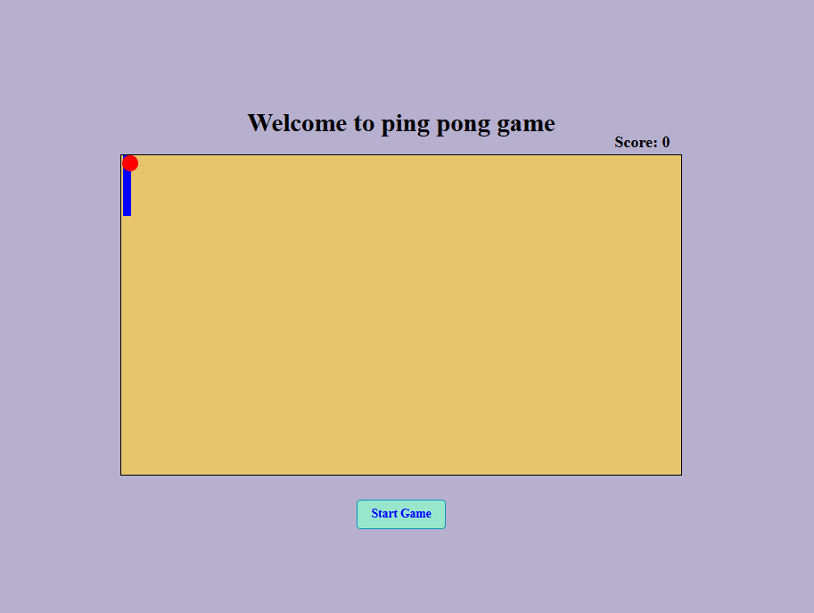

<h2 style="text-align: center; margin: 0px auto; margin-top: -5px;">Landing page</h2>
<ul>
    <li>Click on start button</li>
    <li>Use arrow buttons for movement of paddle and try to hit the ball as much as you can </li>
    <li>When ball hit paddle boundary it bounce back if not hit then game immedialtely stops.</li>
   
</ul>

<h2>Clone the repo or Fork the repo.</h2>